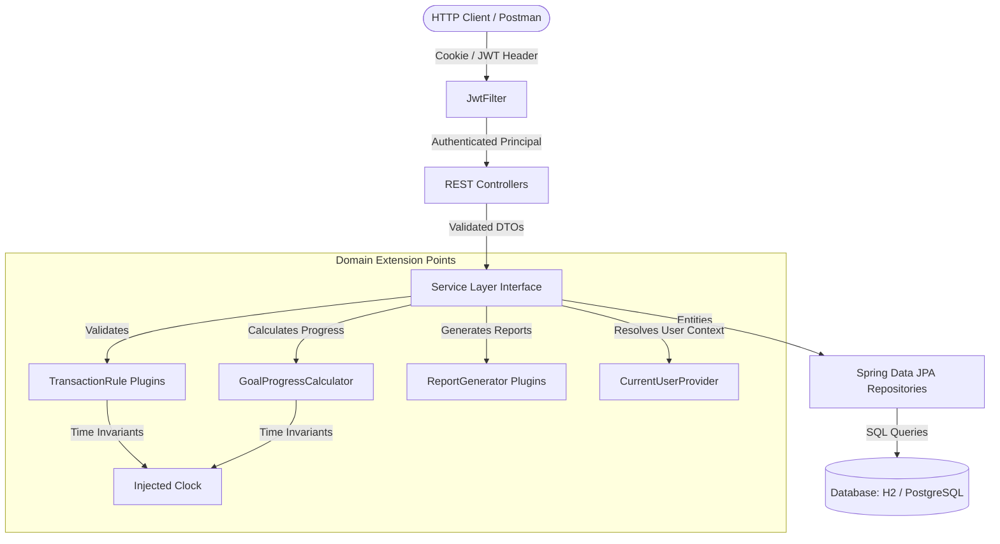

# Personal Finance Manager REST API

A production-ready, modular REST API for personal finance management built with **Java 21**, **Spring Boot 3.5.7**, **Spring Security 6**, and **Spring Data JPA**. The application provides secure JWT authentication stored in `HttpOnly` cookies, category and transaction management, dynamic savings goal progress calculation, and database-aggregated monthly and yearly financial reports.

---

## Table of Contents

- [Features](#features)
- [Architecture & Design Principles](#architecture--design-principles)
- [Technology Stack](#technology-stack)
- [Project Structure](#project-structure)
- [Environment Configuration](#environment-configuration)
- [Getting Started](#getting-started)
  - [Prerequisites](#prerequisites)
  - [Running Locally with H2](#running-locally-with-h2-default)
  - [Running Locally with PostgreSQL](#running-locally-with-postgresql)
  - [Running with Docker](#running-with-docker)
- [Running Tests & Code Coverage](#running-tests--code-coverage)
- [API Reference & Usage Guide](#api-reference--usage-guide)
  - [Authentication](#1-authentication)
  - [Transaction Management](#2-transaction-management)
  - [Category Management](#3-category-management)
  - [Savings Goals](#4-savings-goals)
  - [Reports & Analytics](#5-reports--analytics)
  - [Unified Error Handling](#6-unified-error-handling)
- [End-to-End Example Workflow](#end-to-end-example-workflow)

---

## Features

- **Stateless JWT Authentication:** Secure user authentication using signed JSON Web Tokens (JJWT 0.13) stored in `HttpOnly` cookies (`accessToken` and `refreshToken`), with Authorization `Bearer` header fallback.
- **Strict Data Scoping:** Every query and mutation is automatically scoped to the authenticated user via Spring Security context.
- **Categorization & Derivation:** Transaction types (`INCOME` / `EXPENSE`) are automatically derived from categories. Supports system default categories and user-defined custom categories.
- **Dynamic Savings Goal Computation:** Live calculation of goal progress based on net savings (`INCOME - EXPENSE`) accumulated between `startDate` and `min(today, targetDate)`, floored at 0, along with percentage and remaining balance.
- **Database-Aggregated Reports:** Monthly and annual income/expense breakdowns grouped by category (`GROUP BY category`) executed directly at the database layer.
- **Consistent Error Model:** Centralized REST exception handling returning uniform JSON error responses with standard HTTP status codes.

---

## Architecture & Design Principles

The application strictly implements **SOLID** principles with clean separation of concerns and modular extension points:



### SOLID Mapping
- **Single Responsibility (SRP):** Controllers handle only HTTP requests/responses; services enforce domain rules; mappers perform entity-DTO conversions; `GlobalExceptionHandler` translates exceptions into standard error envelopes.
- **Open / Closed (OCP):**
  - Add transaction validation rules by registering a new `TransactionRule` bean without modifying existing services.
  - Implement alternative goal calculation algorithms via `GoalProgressCalculator`.
  - Add custom reporting intervals by implementing `ReportGenerator`.
- **Liskov Substitution (LSP):** Extensible components strictly honor their contract interfaces.
- **Interface Segregation (ISP):** Focused, minimal interfaces (`CurrentUserProvider`, `TransactionRule`, `GoalProgressCalculator`, `ReportGenerator`).
- **Dependency Inversion (DIP):** High-level services depend on abstractions. Time (`Clock`) and authentication context (`CurrentUserProvider`) are injected dependencies.

---

## Technology Stack

- **Language:** Java 21
- **Framework:** Spring Boot 3.5.7 (Spring Web, Spring Security 6, Spring Data JPA, Spring Validation)
- **Security:** Stateless JWT authentication (`io.jsonwebtoken:jjwt-api:0.13.0`), BCrypt password hashing
- **Databases:**
  - **In-Memory:** H2 Database (used by default and for automated test runs)
  - **Relational:** PostgreSQL (Supabase / production)
- **Monetary Precision:** `BigDecimal` with 2 decimal places (`RoundingMode.HALF_UP`)
- **Testing:** JUnit 5, Mockito, Spring Boot Test, Spring Security Test, MockMvc
- **Code Coverage:** JaCoCo 0.8.12 (enforced >= 80% line coverage requirement)

---

## Project Structure

```text
src/main/java/com/shivanshu/personal_finance_manager
├── PersonalFinanceManagerApplication.java
├── config/
│   ├── ClockConfig.java           # Timezone-aware injectable Clock bean
│   ├── DatabaseConfig.java        # Hikari pool configuration for PostgreSQL poolers
│   ├── DataInitializer.java      # Startup seeder for default categories
│   ├── JwtFilter.java             # OncePerRequestFilter for accessToken cookie/header
│   └── SecurityConfig.java        # Stateless security filter chain & endpoint rules
├── controller/
│   ├── AuthController.java        # Register, Login, Logout endpoints
│   ├── CategoryController.java    # Category CRUD operations
│   ├── GoalController.java        # Savings goals CRUD operations
│   ├── ReportController.java      # Monthly & Yearly reports
│   └── TransactionController.java # Transaction CRUD and filtered search
├── dto/
│   ├── request/                   # Immutable validation records (Create/Update DTOs)
│   └── response/                  # Typed response records
├── entity/
│   ├── Category.java              # Category entity (default or custom per user)
│   ├── CategoryType.java          # INCOME / EXPENSE enum
│   ├── SavingsGoal.java           # Goal entity
│   ├── Transaction.java           # Transaction entity
│   └── UserEntity.java            # Registered user entity
├── exception/
│   ├── ApiException.java          # Domain exception with HTTP status
│   ├── ErrorResponse.java         # Standardized JSON error response record
│   └── GlobalExceptionHandler.java# Centralized @RestControllerAdvice
├── mapper/                        # Entity to DTO mappers
├── repository/                    # Spring Data JPA repositories with JPQL aggregations
├── security/
│   ├── AppUserDetails.java        # UserDetails adapter carrying user ID
│   ├── AppUserDetailsService.java # UserDetailsService database loader
│   ├── CurrentUserProvider.java   # Contract to resolve authenticated user
│   ├── JwtService.java            # JWT creation, claim extraction, and validation
│   ├── RestAuthHandlers.java      # JSON 401 & 403 response writers
│   └── SecurityCurrentUserProvider.java
├── service/                       # Service interfaces and implementations
│   ├── progress/                  # Dynamic goal progress calculators
│   ├── report/                    # Monthly & Yearly report generators
│   └── rule/                      # Transaction validation rules
└── util/
    └── MoneyUtils.java            # Monetary scaling and rounding utilities
```

---

## Environment Configuration

Configuration properties can be set via environment variables or `application.properties`:

| Property | Environment Variable | Default | Description |
| :--- | :--- | :--- | :--- |
| `server.port` | `PORT` | `8080` | Server listening port |
| `spring.datasource.url` | `DB_URL` | `jdbc:h2:mem:pfm;DB_CLOSE_DELAY=-1` | Database JDBC URL |
| `spring.datasource.username` | `DB_USER` | `sa` | Database username |
| `spring.datasource.password` | `DB_PASSWORD` | *(empty)* | Database password |
| `jwt.secret` | `JWT_SECRET` | *(required)* | Base64-encoded secret key for signing JWTs |
| `server.servlet.session.cookie.secure` | `COOKIE_SECURE` | `false` | Set to `true` in HTTPS production environments |
| `app.timezone` | `APP_TIMEZONE` | `Asia/Kolkata` | Application timezone used for date calculations |

---

## Getting Started

### Prerequisites

- **Java Development Kit (JDK):** Version 21 or higher
- **Maven:** 3.9+ (or use the included `./mvnw` / `mvnw.cmd` wrapper)
- **Git**

### Running Locally with H2 (Default)

The repository runs out of the box using an in-memory H2 database with no external services required.

1. **Clone the repository:**
   ```bash
   git clone https://github.com/codes4shiva/personal-finance-manager.git
   cd personal-finance-manager
   ```

2. **Run the application:**
   - **Linux / macOS:**
     ```bash
     JWT_SECRET="QmFiWUtpZXRIdWRkeV9KV1RfU2VjcmV0X0tleV8yMDI2X1N1cGVyU3Ryb25nMTIzNDU2Nzg5MA==" ./mvnw spring-boot:run
     ```
   - **Windows (PowerShell):**
     ```powershell
     $env:JWT_SECRET="QmFiWUtpZXRIdWRkeV9KV1RfU2VjcmV0X0tleV8yMDI2X1N1cGVyU3Ryb25nMTIzNDU2Nzg5MA=="
     .\mvnw.cmd spring-boot:run
     ```

3. The API will be available at `http://localhost:8080`.

### Running Locally with PostgreSQL

To connect to a local PostgreSQL instance or cloud provider (e.g., Supabase):

```bash
export DB_URL="jdbc:postgresql://localhost:5432/personal_finance"
export DB_USER="postgres"
export DB_PASSWORD="your_password"
export JWT_SECRET="QmFiWUtpZXRIdWRkeV9KV1RfU2VjcmV0X0tleV8yMDI2X1N1cGVyU3Ryb25nMTIzNDU2Nzg5MA=="

./mvnw spring-boot:run
```

### Running with Docker

Build and run using the multi-stage `Dockerfile`:

```bash
docker build -t personal-finance-manager .
docker run -p 8080:8080 \
  -e JWT_SECRET="QmFiWUtpZXRIdWRkeV9KV1RfU2VjcmV0X0tleV8yMDI2X1N1cGVyU3Ryb25nMTIzNDU2Nzg5MA==" \
  -e COOKIE_SECURE=false \
  personal-finance-manager
```

---

## Running Tests & Code Coverage

The project includes unit and integration tests using `MockMvc` executing against an isolated in-memory test database.

Run the test suite and verify JaCoCo coverage:

```bash
# Linux / macOS
./mvnw clean verify

# Windows
.\mvnw.cmd clean verify
```

JaCoCo generates an HTML coverage report at:
```text
target/site/jacoco/index.html
```
The build enforces a minimum of **80% line coverage**.

---

## API Reference & Usage Guide

All endpoints are rooted under `/api`. All JSON request bodies and responses use standard `application/json`.

### Status Code Summary

| Endpoint | Method | Success | Error Statuses | Description |
| :--- | :--- | :--- | :--- | :--- |
| `/api/auth/register` | `POST` | `201` | `400`, `409` | Register a new user |
| `/api/auth/login` | `POST` | `200` | `401` | Authenticate & set session cookie |
| `/api/auth/logout` | `POST` | `200` | `401` | Clear session cookie |
| `/api/transactions` | `POST` | `201` | `400`, `401` | Create a transaction |
| `/api/transactions` | `GET` | `200` | `401` | List transactions with filters |
| `/api/transactions/{id}` | `PUT` | `200` | `400`, `401`, `404` | Partial transaction update |
| `/api/transactions/{id}` | `DELETE`| `200` | `401`, `404` | Delete a transaction |
| `/api/categories` | `GET` | `200` | `401` | List system & user categories |
| `/api/categories` | `POST` | `201` | `400`, `401`, `409` | Create a custom category |
| `/api/categories/{name}` | `DELETE`| `200` | `400`, `401`, `403`, `404` | Delete a custom category |
| `/api/goals` | `POST` | `201` | `400`, `401` | Create a savings goal |
| `/api/goals` | `GET` | `200` | `401` | List user savings goals |
| `/api/goals/{id}` | `GET` | `200` | `400`, `401`, `403`, `404` | Get a specific goal |
| `/api/goals/{id}` | `PUT` | `200` | `400`, `401`, `403`, `404` | Partial goal update |
| `/api/goals/{id}` | `DELETE`| `200` | `401`, `403`, `404` | Delete a savings goal |
| `/api/reports/monthly/{year}/{month}` | `GET` | `200` | `401` | Monthly income/expense report |
| `/api/reports/yearly/{year}` | `GET` | `200` | `401` | Yearly income/expense report |

> **General Rule:** Any malformed path variable or query parameter (e.g., non-numeric ID, invalid date format, month outside 1–12) returns `400 Bad Request`.

---

### 1. Authentication

#### Register User
```http
POST /api/auth/register
Content-Type: application/json
```
**Request Body:**
```json
{
  "username": "user@example.com",
  "password": "password123",
  "fullName": "John Doe",
  "phoneNumber": "+1234567890"
}
```
**Response (`201 Created`):**
```json
{
  "message": "User registered successfully",
  "userId": 1
}
```

#### Login
```http
POST /api/auth/login
Content-Type: application/json
```
**Request Body:**
```json
{
  "username": "user@example.com",
  "password": "password123"
}
```
**Response (`200 OK`):**
```json
{
  "message": "Login successful"
}
```
*Sets `Set-Cookie: accessToken=...; Path=/; HttpOnly; SameSite=Lax`.*

#### Logout
```http
POST /api/auth/logout
```
**Response (`200 OK`):**
```json
{
  "message": "Logout successful"
}
```

---

### 2. Transaction Management

#### Create Transaction
```http
POST /api/transactions
Content-Type: application/json
```
- `category` is matched against system defaults or the authenticated user's custom categories.
- `type` (`INCOME` / `EXPENSE`) is automatically derived from the matched category.
- `amount` must be `> 0`. `date` format: `YYYY-MM-DD`.

**Request Body:**
```json
{
  "amount": 50000.00,
  "date": "2024-01-15",
  "category": "Salary",
  "description": "January Salary"
}
```
**Response (`201 Created`):**
```json
{
  "id": 1,
  "amount": 50000.00,
  "date": "2024-01-15",
  "category": "Salary",
  "description": "January Salary",
  "type": "INCOME"
}
```

#### Get Transactions
```http
GET /api/transactions?startDate=2024-01-01&endDate=2024-01-31&categoryId=1
```
Query parameters `startDate`, `endDate`, and `categoryId` are optional and combinable. Only returns transactions owned by the current authenticated user.

**Response (`200 OK`):**
```json
{
  "transactions": [
    {
      "id": 1,
      "amount": 50000.00,
      "date": "2024-01-15",
      "category": "Salary",
      "description": "January Salary",
      "type": "INCOME"
    }
  ]
}
```

#### Update Transaction (Partial)
```http
PUT /api/transactions/{id}
Content-Type: application/json
```
Any of `amount`, `description`, `category`, or `date` may be provided. Only provided fields change. Returns `404 Not Found` if missing or owned by another user.

**Request Body:**
```json
{
  "amount": 60000.00,
  "description": "Updated January Salary"
}
```
**Response (`200 OK`):**
```json
{
  "id": 1,
  "amount": 60000.00,
  "date": "2024-01-15",
  "category": "Salary",
  "description": "Updated January Salary",
  "type": "INCOME"
}
```

#### Delete Transaction
```http
DELETE /api/transactions/{id}
```
Returns `404 Not Found` if missing or owned by another user.

**Response (`200 OK`):**
```json
{
  "message": "Transaction deleted successfully"
}
```

---

### 3. Category Management

Default categories are seeded at startup:
- **INCOME:** `Salary`, `Freelance`
- **EXPENSE:** `Food`, `Rent`, `Transportation`, `Entertainment`, `Healthcare`, `Utilities`

#### Get All Categories
```http
GET /api/categories
```
Returns system defaults (`isCustom: false`) plus the current user's custom categories (`isCustom: true`). Never exposes other users' custom categories.

**Response (`200 OK`):**
```json
{
  "categories": [
    {
      "name": "Salary",
      "type": "INCOME",
      "isCustom": false
    },
    {
      "name": "Food",
      "type": "EXPENSE",
      "isCustom": false
    },
    {
      "name": "SideBusinessIncome",
      "type": "INCOME",
      "isCustom": true
    }
  ]
}
```

#### Create Custom Category
```http
POST /api/categories
Content-Type: application/json
```
**Request Body:**
```json
{
  "name": "SideBusinessIncome",
  "type": "INCOME"
}
```
**Response (`201 Created`):**
```json
{
  "name": "SideBusinessIncome",
  "type": "INCOME",
  "isCustom": true
}
```
*Returns `409 Conflict` if the name already exists as a default or user custom category.*

#### Delete Custom Category
```http
DELETE /api/categories/{name}
```
- Returns `403 Forbidden` if attempting to delete a system default category.
- Returns `404 Not Found` if category does not exist for the user.
- Returns `400 Bad Request` if existing transactions are associated with the category.

**Response (`200 OK`):**
```json
{
  "message": "Category deleted successfully"
}
```

---

### 4. Savings Goals

Savings goals dynamically compute progress on every request:
$$\text{currentProgress} = \max\left(\sum \text{Income} - \sum \text{Expense}, 0\right) \quad \text{between } \text{startDate} \text{ and } \min(\text{today}, \text{targetDate})$$
$$\text{progressPercentage} = \operatorname{round}\left(\frac{\text{currentProgress}}{\text{targetAmount}} \times 100, 2\right)$$
$$\text{remainingAmount} = \max(\text{targetAmount} - \text{currentProgress}, 0)$$

#### Create Goal
```http
POST /api/goals
Content-Type: application/json
```
Validation: `goalName` required, `targetAmount > 0`, `targetDate` after `startDate`.

**Request Body:**
```json
{
  "goalName": "Emergency Fund",
  "targetAmount": 5000.00,
  "targetDate": "2026-01-01",
  "startDate": "2025-01-01"
}
```
**Response (`201 Created`):**
```json
{
  "id": 1,
  "goalName": "Emergency Fund",
  "targetAmount": 5000.00,
  "targetDate": "2026-01-01",
  "startDate": "2025-01-01",
  "currentProgress": 1000.00,
  "progressPercentage": 20.00,
  "remainingAmount": 4000.00
}
```

#### Get All Goals
```http
GET /api/goals
```
Returns all goals belonging to the authenticated user.

**Response (`200 OK`):**
```json
{
  "goals": [
    {
      "id": 1,
      "goalName": "Emergency Fund",
      "targetAmount": 5000.00,
      "targetDate": "2026-01-01",
      "startDate": "2025-01-01",
      "currentProgress": 1000.00,
      "progressPercentage": 20.00,
      "remainingAmount": 4000.00
    }
  ]
}
```

#### Get Goal by ID
```http
GET /api/goals/{id}
```
- Returns `404 Not Found` if goal ID does not exist.
- Returns `403 Forbidden` if goal belongs to another user.
- Returns `400 Bad Request` if `{id}` is non-numeric.

#### Update Goal (Partial)
```http
PUT /api/goals/{id}
Content-Type: application/json
```
Supports partial updates (e.g., updating only `targetAmount` and `targetDate`).

**Request Body:**
```json
{
  "targetAmount": 6000.00,
  "targetDate": "2026-02-01"
}
```
**Response (`200 OK`):**
```json
{
  "id": 1,
  "goalName": "Emergency Fund",
  "targetAmount": 6000.00,
  "targetDate": "2026-02-01",
  "startDate": "2025-01-01",
  "currentProgress": 1000.00,
  "progressPercentage": 16.67,
  "remainingAmount": 5000.00
}
```

#### Delete Goal
```http
DELETE /api/goals/{id}
```
Returns `404 Not Found` if missing, or `403 Forbidden` if owned by another user.

**Response (`200 OK`):**
```json
{
  "message": "Goal deleted successfully"
}
```

---

### 5. Reports & Analytics

Aggregations are executed directly in the database (`GROUP BY category`), scoped to the authenticated user. Periods with no recorded transactions return empty maps and `netSavings: 0.00` with `200 OK`.

#### Monthly Report
```http
GET /api/reports/monthly/{year}/{month}
```
**Response (`200 OK`):**
```json
{
  "month": 1,
  "year": 2024,
  "totalIncome": {
    "Salary": 3000.00,
    "Freelance": 500.00
  },
  "totalExpenses": {
    "Food": 400.00,
    "Rent": 1200.00,
    "Transportation": 200.00
  },
  "netSavings": 1700.00
}
```

#### Yearly Report
```http
GET /api/reports/yearly/{year}
```
**Response (`200 OK`):**
```json
{
  "year": 2024,
  "totalIncome": {
    "Salary": 36000.00,
    "Freelance": 6000.00
  },
  "totalExpenses": {
    "Food": 4800.00,
    "Rent": 14400.00,
    "Transportation": 2400.00
  },
  "netSavings": 20400.00
}
```

---

### 6. Unified Error Handling

All API errors return consistent JSON structures adhering to `ErrorResponse`:

```json
{
  "status": 400,
  "error": "Bad Request",
  "message": "Validation failed",
  "details": [
    "amount: Amount must be greater than 0",
    "date: Date is required"
  ]
}
```

| HTTP Status | Reason | Typical Cause |
| :--- | :--- | :--- |
| `400 Bad Request` | `Bad Request` | Validation failure, malformed query/path parameters, category in use on delete |
| `401 Unauthorized` | `Unauthorized` | Missing or invalid authentication token / cookie |
| `403 Forbidden` | `Forbidden` | Deleting default category, accessing another user's goal |
| `404 Not Found` | `Not Found` | Resource ID not found, accessing another user's transaction |
| `409 Conflict` | `Conflict` | Duplicate username or existing category name |
| `500 Internal Server Error`| `Internal Server Error` | Unexpected unhandled server exception |

---

## End-to-End Example Workflow

Below is a complete workflow using `curl` with cookie storage:

```bash
# 1. Register a new user account
curl -X POST http://localhost:8080/api/auth/register \
  -H "Content-Type: application/json" \
  -d '{
    "username": "alex@example.com",
    "password": "SecurePassword123!",
    "fullName": "Alex Smith",
    "phoneNumber": "+1234567890"
  }'

# 2. Login and store authentication cookies
curl -X POST http://localhost:8080/api/auth/login \
  -c cookies.txt \
  -H "Content-Type: application/json" \
  -d '{
    "username": "alex@example.com",
    "password": "SecurePassword123!"
  }'

# 3. Create a custom category
curl -X POST http://localhost:8080/api/categories \
  -b cookies.txt \
  -H "Content-Type: application/json" \
  -d '{
    "name": "SideGig",
    "type": "INCOME"
  }'

# 4. Log income and expense transactions
curl -X POST http://localhost:8080/api/transactions \
  -b cookies.txt \
  -H "Content-Type: application/json" \
  -d '{
    "amount": 4000.00,
    "date": "2025-02-01",
    "category": "Salary",
    "description": "February Salary"
  }'

curl -X POST http://localhost:8080/api/transactions \
  -b cookies.txt \
  -H "Content-Type: application/json" \
  -d '{
    "amount": 1000.00,
    "date": "2025-02-05",
    "category": "Rent",
    "description": "February Rent"
  }'

# 5. Create a savings goal and view live computed progress
curl -X POST http://localhost:8080/api/goals \
  -b cookies.txt \
  -H "Content-Type: application/json" \
  -d '{
    "goalName": "Europe Trip",
    "targetAmount": 10000.00,
    "startDate": "2025-01-01",
    "targetDate": "2026-06-01"
  }'

# 6. Retrieve monthly report aggregated from the database
curl -X GET http://localhost:8080/api/reports/monthly/2025/2 \
  -b cookies.txt

# 7. Logout
curl -X POST http://localhost:8080/api/auth/logout \
  -b cookies.txt -c cookies.txt
```
